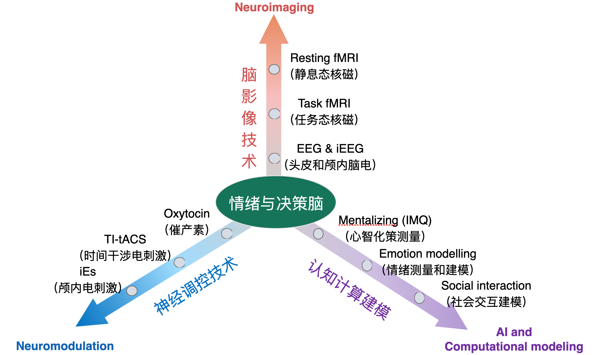
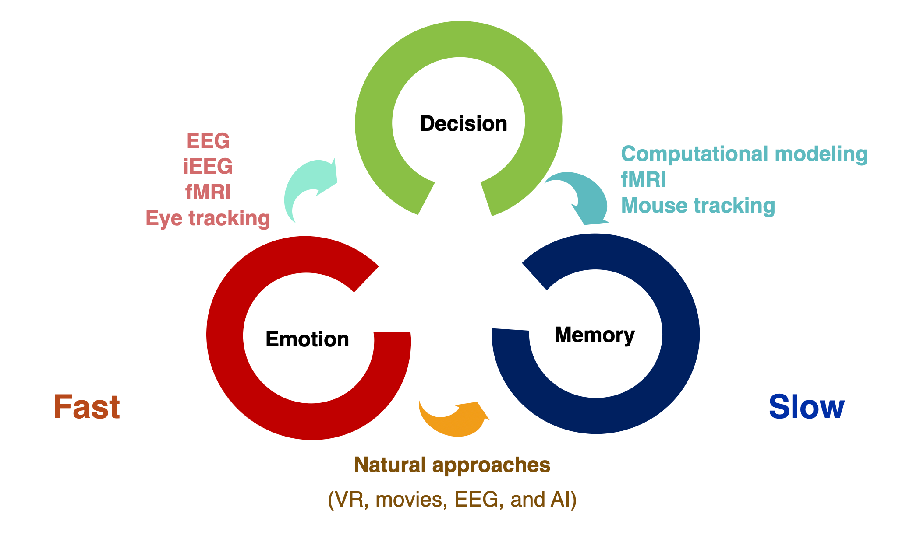
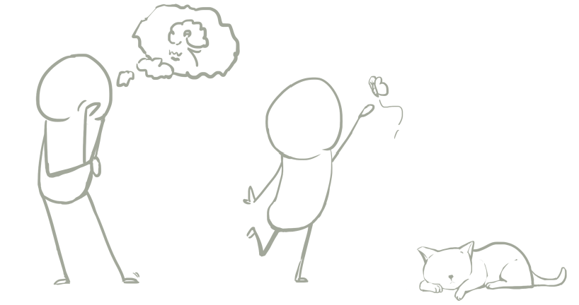
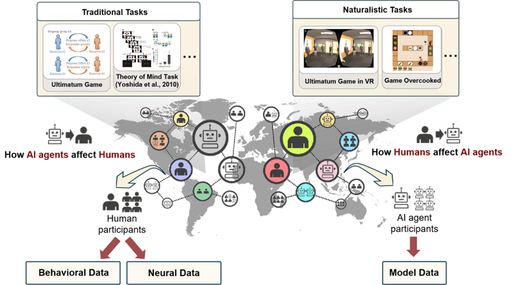
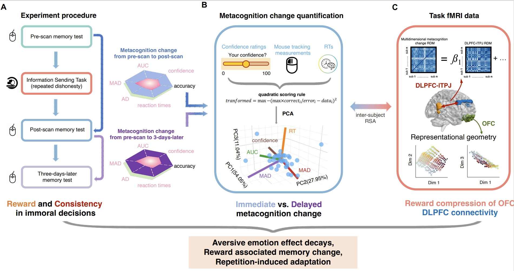
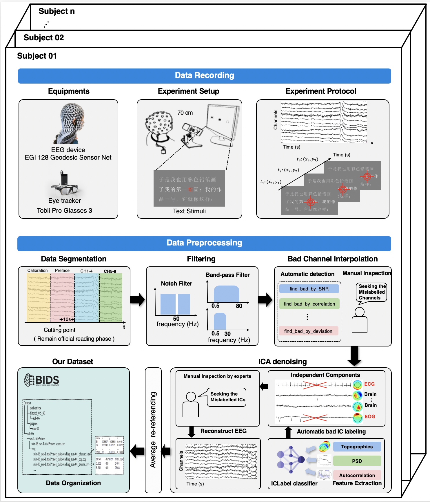

The Affective, Neuroscience, and Decision-making lab is led by Prof Haiyan WU, and is located at the Centre for Cognitive and Brain Sciences at the University of Macau (UM), Macau SAR, China.

## Roadmap

<!-- Our current **research directions**: -->
## Research Directions

1) *Computational Modeling and Quantification of Social Cognitive Processes*:
   How can we develop robust computational frameworks to quantify and measure critical dimensions of social inference, decision-making, and strategic interactions?

2) *Neuromodulation of Social Adaptive Mechanisms*:
   What are the neural and cognitive mechanisms underlying social adaptation, and how can they be selectively modulated to enhance or alter adaptive behaviors?

3) *Neurocomputational Dynamics of Reward and Punishment in Human-AI Interactions*:
   How do reward and punishment systems interact and compete during social decision-making, particularly in the context of human interactions with artificial agents?

## News

**2025.9.2** Shuo delivered a talk at the Swarma Club on “Agent Modeling and Simulation in the Era of Large-Scale Models.” He explored the similarities and differences between cognitive neuroscience and social science agent modeling, analyzed the applications and limitations of reinforcement learning and neural networks, discussed the advantages and challenges of large-scale models in cognitive tasks, and highlighted their potential in modeling human cognition.

**2025.8.27** Haoming and Kun successfully defended  their PhD today, congratulations!

**2025.7.1** ANDLab's work titled "An intracranial dissection of human escape circuits." is published by *Nature communications*!

**2025.5.10** ANDLab has preprinted a perspective article titled "AI in the computation and regulation of social decision-making."（Authors: Shuo Zhang, Leo Chi U Seak, Raymond J Dolan, and Haiyan Wu）. This article argues that  social decision research should fully leverage the potential of AI to advance task design, data analysis, and human-AI interaction research comprehensively. 
In the era of artificial intelligence (AI), social decision-making research stands at a transformative crossroads. The rise of AI has introduced innovative perspectives and methodologies, enabling researchers to address challenges in social decision-making in unprecedented ways. Leveraging AI's powerful data processing capabilities, researchers can transcend the limitations of traditional experimental paradigms and design tasks that more closely resemble real-world scenarios, exploring social decisions in more realistic contexts. By utilizing diverse AI models, researchers can analyze complex social interaction data, model social agents, or simulate social dynamics. Moreover, as AI becomes increasingly embedded in people's daily lives, it is imperative to incorporate AI as an interactive agent, systematically examining its impact on humans and the interactions between humans and these more advanced AI systems. To prepare for a society where humans and AI coexist, we advocate for establishing an online social task platform where human participants and AI agents coexist. This hybrid platform emphasizes multiple agents, the generalization from traditional tasks to naturalistic tasks, and integrative platforms with the interface of neuroimage data, providing an effective framework for exploring social cognition in the AI era. These advancements help pave the way for developing socially intelligent AI systems equipped with intuition and ethics, enabling seamless and natural interactions within complex social ecosystems. Our review aims to advance the scientific understanding of human social cognition while promoting the development of AI systems that integrate AI tools and agents into social decision-making and social neuroscience studies.

**2025.4.28** ANDLab's demo "Emotional AI: Pain detection and empathy AI" accepted interviews from more than 20 media including People's Daily, TDM (Macau).

**2025.4.17** Dr. Yongling Lin shared their work "Basis functions for complex social decisions in dorsomedial frontal cortex" in our Journal Club!

**2025.3.21** Shuo's work titled "The neural correlates of novelty and variability in human decision-making under an active inference framework" is published by *eLife*!

**2025.2.13** ANDLab's work titled "Emotional intelligence of large language models and its psychological applications" is published by *Science & Technology Review*!

**2024.9.9** Keyu's work titled "The Association between Social Rewards and Anxiety:Links from Neurophysiological Analysis in Virtual Reality and Social Interaction Game" got accepted by *NeuroImage*!

**2024.8.30** Siying Li successfully defended her PhD today!

**2024.3.31** ANDLab held a workshop on *PPT Graphing in Academia* presented by Zhexu. The session covered key tips for creating PowerPoint visuals for academic purposes. Watch the full recording on YouTube: [ANDlab workshop- plotting with PowerPoint](https://youtu.be/7xqX-s8AD2s).

**2024.3.13** ANDLab preprinted an article titled ‘Unethical amnesia brain: Memory and metacognitive distortion induced by dishonesty’. In this article, we investigate the neural and computational mechanisms underlying the metacognition distortion caused by repeated dishonesty.
We find that: 
1) Immediate and delayed metacognition changes manifest on multiple dimensions of response in the pre-and post-scan memory tasks;
2) The compression of representational geometry of reward in OFC was correlated with both immediate and delayed metacognition changes;
3) Functional connectivity (FC) between DLPFC and lTPJ under dishonest responses predicts both immediate and delayed metacognition changes.

These results suggest that decision-making, emotion, and memory-related brain regions together play a key role in metacognition change after immoral action, shedding light on the neural mechanism of the complex interplay between moral decisions, cognitive processes, and memory distortion.

**2024.2.10** ANDLab preprinted a high-density EEG dataset (https://www.biorxiv.org/content/10.1101/2024.02.08.579481v1)
 stimulated by Chinese, 12 hours of reading Chinese, providing 128-channel EEG, preprocessing, source localization, and text embedding of the pre-trained model. Many thanks to our collaborators!!

**2024.1.16** ANDLab preprinted an article titled "An intracranial dissection of human escape circuits". In this preprint, we found the brain regions in the cognitive fear circuit, including the ventromedial prefrontal cortex and hippocampus, encoded the threat level during the information processing stage. The actual escaping stage, especially under rapid attack, prominently activated areas within the reactive fear circuit, including the midcingulate cortex and amygdala. Furthermore, we observed a negative correlation between the high gamma activity (HGA) of the amygdala and the HGA of the vmPFC and HPC under rapid attacks. This indicates that the amygdala may suppress the activity of the cognitive fear circuit under rapid attacks, enabling the organism to react quickly to ensure survival under the imminent threat. @Macau

**2023.10.14** Prof. Wu Haiyan delivered a presentation on the neurolaw research led by Jiamin at the 25th Psychological Academic Conference. @Chengdu
