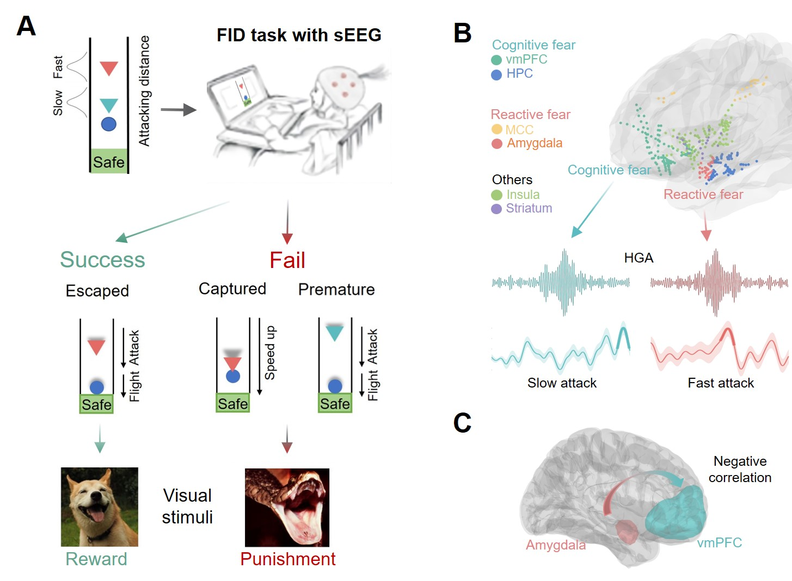

The Affective, Neuroscience, and Decision-making lab is located at the [Centre for Cognitive and Brain Sciences](https://ccbs.ici.um.edu.mo){:target="_blank"} (CCBS) at [University of Macau](https://um.edu.mo){:target="_blank"} (UM), Macau SAR, China.

<!-- Our current **research directions**: -->
## Research Directions

1) *Social cognition and affective neuroscience*: the multi-modal representation of negative emotional experiences (anxiety, fear, helpless) and its neurocomputation; the learning and representation of social information (social distance, emotional variability, affiliation) and its influence on social relationship; the neurocomputation of mentalizing and social decision-making (dishonesty decisions); the effect of pharmaceutical modulation (oxytocin) and neuromodulation (TMS&TDCS) on social cognition and behaviors.

2) *Computational neuroscience*: we mainly leverage Bayesian modeling, Reinforcement learning, Drift-diffusion model to quantify human social learning and adaptive social decision-making.

3) *Artificial intelligence (AI) and Human-AI interaction*: e.g., how AI facilitates empathy and interaction between human-AI and even between human-human, how human perceive and inference the affect of AI.

## News

*2023.10.14* Prof. Wu Haiyan delivered a presentation on the neurolaw research led by Jiamin at the 25th Psychological Academic Conference. @Chengdu

*2024.1.16* ANDLab preprinted an article titled "An intracranial dissection of human escape circuits". @Macau

